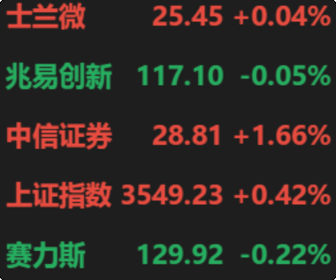

# A股行情监控系统

本软件是一个用于实时监控A股行情的桌面应用程序，采用Python和PyQt5开发，具有简洁美观的界面和丰富的功能。



## 项目结构

```
stock_monitor/
├── config/                 # 配置管理模块
│   ├── __init__.py
│   └── manager.py         # 配置加载和保存功能
├── core/                  # 核心业务逻辑模块
│   ├── __init__.py
│   ├── market_manager.py  # 市场管理器
│   ├── stock_manager.py   # 股票管理器
│   └── stock_service.py   # 股票服务
├── data/                  # 数据处理模块
│   ├── market/
│   │   ├── __init__.py
│   │   ├── quotation.py   # 行情数据处理
│   │   └── updater.py     # 市场数据更新
│   ├── stock/
│   │   ├── __init__.py
│   │   └── stocks.py      # 股票数据处理
│   └── __init__.py
├── network/               # 网络请求模块
│   ├── __init__.py
│   └── manager.py         # 网络请求封装
├── resources/             # 资源文件目录
│   ├── icon.ico           # 应用图标
│   └── stock_basic.json   # 股票基础数据
├── ui/                    # 用户界面模块
│   ├── components/
│   │   ├── __init__.py
│   │   └── stock_table.py # 股票表格组件
│   ├── dialogs/
│   │   ├── __init__.py
│   │   └── settings_dialog.py # 设置对话框
│   ├── widgets/
│   │   ├── __init__.py
│   │   ├── market_status.py   # 市场状态条组件
│   │   └── stock_search.py    # 股票搜索组件
│   └── __init__.py
├── utils/                 # 工具模块
│   ├── __init__.py
│   ├── cache.py           # 数据缓存
│   ├── error_handler.py   # 错误处理
│   ├── helpers.py         # 辅助函数
│   ├── log_cleaner.py     # 日志清理工具
│   ├── logger.py          # 日志记录
│   └── stock_cache.py     # 股票缓存
├── __init__.py
└── main.py                # 主程序入口

其他文件:
├── API.md                 # API文档
├── build.py               # 构建脚本
├── build_config.py        # 构建配置
├── requirements.txt       # 生产环境依赖列表
├── requirements-dev.txt   # 开发环境依赖列表（包含测试依赖）
├── CHANGELOG.md           # 更新日志
└── README.md              # 项目说明文档
```

## 模块功能详解

### 1. 主程序模块 (main.py)

主程序是整个应用的入口点，负责初始化界面、启动后台线程和协调各模块工作。

主要功能：
- 初始化主窗口和系统托盘
- 启动数据刷新线程
- 启动数据库更新线程
- 处理用户交互（拖拽、右键菜单等）
- 管理配置加载和保存
- 实现窗口位置记忆功能

### 2. 配置管理模块 (config/)

负责应用配置的加载、保存和管理。

主要文件：
- [manager.py](file:///D:/code/stock/stock_monitor/config/manager.py): 提供配置文件的加载、保存和股市开市时间判断功能

### 3. 数据处理模块 (data/)

负责股票数据的获取、处理和更新。

主要文件：
- [quotation.py](file:///D:/code/stock/stock_monitor/data/quotation.py): 处理行情数据，包括价格计算、涨跌幅计算、封单检测等
- [stocks.py](file:///D:/code/stock/stock_monitor/data/stocks.py): 加载股票基础数据，处理拼音信息等
- [updater.py](file:///D:/code/stock/stock_monitor/data/updater.py): 从网络获取最新的股票数据并更新本地数据库

### 4. 网络请求模块 (network/)

封装了所有网络请求相关的功能，提供统一的网络接口。

主要文件：
- [manager.py](file:///D:/code/stock/stock_monitor/network/manager.py): 网络请求管理器，封装GET/POST请求和GitHub API请求

### 5. 用户界面模块 (ui/)

负责所有用户界面的展示和交互。

主要文件：
- [components.py](file:///D:/code/stock/stock_monitor/ui/components.py): UI基础组件
- [market_status.py](file:///D:/code/stock/stock_monitor/ui/market_status.py): 市场状态条组件，可视化展示整体市场涨跌情况
- [settings_dialog.py](file:///D:/code/stock/stock_monitor/ui/dialogs/settings_dialog.py): 设置对话框，用于管理自选股、刷新频率等设置

### 6. 工具模块 (utils/)

提供通用的工具函数和辅助功能。

主要文件：
- [error_handler.py](file:///D:/code/stock/stock_monitor/utils/error_handler.py): 错误处理和异常管理
- [helpers.py](file:///D:/code/stock/stock_monitor/utils/helpers.py): 辅助函数，如资源路径获取、emoji处理等
- [logger.py](file:///D:/code/stock/stock_monitor/utils/logger.py): 日志记录功能
- [log_cleaner.py](file:///D:/code/stock/stock_monitor/utils/log_cleaner.py): 日志清理工具，定期删除过期日志文件

### 7. 资源文件 (resources/)

存放应用所需的静态资源文件。

主要文件：
- icon.ico: 应用图标
- stock_basic.json: 股票基础数据，包括股票代码和名称

## 主要功能

### 1. 实时行情监控
- 实时显示自选股的最新价格和涨跌幅
- 支持多种股票类型（A股、指数等）
- 颜色标识涨跌状态，涨幅超过5%使用更亮的橙红色突出显示

### 2. 涨跌停封单显示
- 自动识别并高亮显示涨停/跌停股票的封单手数
- 封单数以"k"为单位显示，简洁明了

### 3. 市场状态可视化
- 底部状态条可视化展示整个市场的涨跌情况
- 红色表示上涨，绿色表示下跌，灰色表示平盘

### 4. 自选股管理
- 支持添加、删除自选股
- 支持通过股票代码、名称、拼音、首字母等多种方式搜索股票
- 支持ST股票的特殊处理和模糊搜索

### 5. 灵活的界面操作
- 支持窗口拖拽移动
- 右键菜单提供设置和退出选项
- 窗口位置自动记忆

### 6. 智能刷新机制
- 支持多种刷新频率设置（2秒、5秒、10秒、30秒、60秒）
- 开市期间按设定频率刷新，休市期间降低刷新频率

### 7. 自动更新功能
- 支持自动检测并下载新版本
- 可配置GitHub Token以提高API请求限制

### 8. 开机自启动
- 支持设置开机自动启动

### 9. 日志自动清理
- 自动清理7天前的日志文件，防止日志文件过大
- 每24小时检查一次并清理过期日志

## 使用说明

1. 运行 `python main.py` 启动（需安装依赖，见 requirements.txt）
2. Windows 可用打包版，下载 release 页的 `stock_monitor.zip` 解压即用
3. 右键点击窗口可打开设置界面，管理自选股、刷新频率、开机启动等

## 测试运行

### 开发环境运行

```bash
# 1. 克隆项目
git clone <项目地址>
cd stock_monitor

# 2. 安装依赖
pip install -r requirements.txt

# 3. 运行程序
python -m stock_monitor.main
# 或者
cd stock_monitor && python main.py
```

### 测试日志清理功能

```bash
# 测试清理过期日志功能
python -c "from stock_monitor.utils.log_cleaner import clean_old_logs; print('清理过期日志...'); deleted = clean_old_logs(); print(f'已删除 {deleted} 个过期日志文件')"
```

## 依赖环境

### 生产环境依赖
- Python 3.7+
- PyQt5
- easyquotation
- pypinyin
- packaging
- pywin32

### 开发环境依赖
除了生产环境依赖外，还包括：
- pytest（用于测试）

## 构建与发布

- 采用 GitHub Actions 自动打包，主分支变动即触发
- 打包产物为 `stock_monitor.zip`，含所有依赖，解压即用
- Release 日志自动从 CHANGELOG.md 提取，最新在前