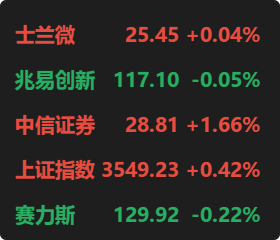

# A股行情监控软件

> **⚠️ 重要声明：本软件完全由AI编写，开发者为0基础菜鸟，仅供学习交流使用**

一个基于PyQt5开发的轻量级A股行情监控软件，提供实时股票行情显示、自选股管理、系统托盘等功能。

## ✨ 主要功能

### 📊 实时行情监控
- **实时显示**：股票名称、现价、涨跌幅，红涨绿跌
- **自动刷新**：支持2秒到60秒的刷新频率设置
- **开市检测**：自动识别A股开市时间，休市时降低刷新频率
- **多股票支持**：同时监控多只股票

### 🎯 自选股管理
- **智能搜索**：支持股票代码、名称、拼音模糊搜索
- **一键添加**：双击或回车快速添加到自选股
- **拖拽排序**：支持自选股列表拖拽调整顺序
- **批量删除**：支持多选删除功能
- **自动保存**：所有设置自动保存，重启后恢复

### 🎨 极简界面设计
- **现代化UI**：采用极简设计风格，界面清爽美观
- **自适应布局**：界面根据内容自动调整大小
- **窗口置顶**：支持窗口始终置顶显示
- **窗口拖拽**：支持窗口自由拖拽移动
- **系统托盘**：最小化到系统托盘，右键菜单控制

### ⚙️ 个性化设置
- **刷新频率**：2秒(极速)到60秒(极慢)可调
- **开机启动**：支持开机自动启动
- **位置记忆**：自动保存窗口位置
- **设置记忆**：所有设置自动保存

## 🖼️ 界面预览

### 主界面
- 紧凑的股票行情显示
- 红涨绿跌的颜色区分
- 支持窗口拖拽和置顶

### 设置界面
- 左侧：股票搜索和添加
- 右侧：自选股列表管理
- 底部：刷新频率、开机启动等设置

## 🚀 快速开始

### 环境要求
- Python 3.7+
- Windows 10/11
- 网络连接（用于获取股票数据）

### 安装依赖
```bash
pip install -r requirements.txt
```

### 运行软件
```bash
python main.py
```

### 打包成exe
```bash
# 方法1：使用构建脚本（推荐）
python build.py

# 方法2：直接使用PyInstaller
pyinstaller -w -i icon.ico -n stock_monitor main.py --add-data ".venv/Lib/site-packages/easyquotation/stock_codes.conf;easyquotation" --add-data "stock_basic.json;." --add-data "theme_config.json;."
```

### 🚀 自动构建
本项目配置了GitHub Actions，提供三种构建方式：

#### 自动触发
- **🚀 Auto Release**：推送`main.py`到main分支时自动创建正式发布
- **🔨 Build Stock Monitor**：核心文件变化时自动构建测试版本
- **⚡ Quick Build**：`main.py`变化时快速构建

#### 手动触发
1. 进入GitHub仓库的Actions页面
2. 选择需要的工作流
3. 点击"Run workflow"按钮

#### 构建产物
- **正式版本**：GitHub Releases页面下载
- **测试版本**：Actions Artifacts页面下载
- **版本管理**：自动生成版本号（格式：v1.0.YYYYMMDD-commit）

**详细说明**：查看 [GITHUB_ACTIONS.md](GITHUB_ACTIONS.md) 获取完整使用指南。

## 📖 使用说明

### 基本操作
1. **启动软件**：运行后软件会显示在屏幕右下角
2. **添加股票**：右键点击托盘图标 → 设置 → 搜索股票 → 双击添加
3. **删除股票**：在设置界面选中股票 → 点击"删除选中"
4. **调整刷新频率**：在设置界面选择刷新频率
5. **窗口控制**：左键拖拽移动窗口，右键显示菜单

### 股票搜索
- 支持股票代码：`000001`、`sh000001`
- 支持股票名称：`平安银行`、`中国平安`
- 支持拼音搜索：`pab`（平安银行）

### 系统托盘
- **左键点击**：显示/隐藏主窗口
- **右键点击**：显示菜单（设置、退出）

## 🛠️ 技术架构

### 核心技术
- **PyQt5**：图形界面框架
- **easyquotation**：股票行情数据接口
- **threading**：多线程处理
- **json**：配置文件存储

### 数据来源
- 基于新浪财经API
- 实时获取A股行情数据
- 支持股票、指数、基金等

### 文件结构
```
stock/
├── main.py              # 主程序文件
├── icon.png             # 托盘图标
├── icon.ico             # 应用图标
├── requirements.txt     # 依赖库列表
├── stock_basic.json     # 股票基础数据
├── theme_config.json    # 主题配置
├── build.py             # 构建脚本
├── config.json         # 用户配置（自动生成）
└── .github/
    └── workflows/       # GitHub Actions工作流
        ├── build.yml    # 完整构建工作流
        ├── quick-build.yml # 快速构建工作流
        └── release.yml  # 自动发布工作流
```

## 🎯 开发历程

### 开发背景
- 开发者为0基础菜鸟
- 完全依靠AI辅助开发
- 从零开始学习Python和PyQt5

### 开发过程
1. **需求分析**：确定软件功能和界面设计
2. **技术选型**：选择PyQt5作为界面框架
3. **功能实现**：逐步实现各个功能模块
4. **界面优化**：多次调整界面样式和布局
5. **代码优化**：精简代码，提升性能
6. **测试完善**：修复bug，完善功能

### 技术难点
- **多线程处理**：避免界面卡顿
- **数据同步**：确保数据实时更新
- **界面布局**：实现自适应布局
- **异常处理**：处理网络异常和数据异常

## 📝 更新日志

### v1.0.0 (当前版本)
- ✅ 实现基础股票行情显示
- ✅ 完成自选股管理功能
- ✅ 优化界面设计，采用极简风格
- ✅ 实现系统托盘功能
- ✅ 添加设置界面和配置保存
- ✅ 优化代码结构，提升性能
- ✅ 完善异常处理和用户体验

image.png

## 🤝 贡献指南

由于开发者是0基础菜鸟，欢迎各位大佬提供建议和帮助：

1. **问题反馈**：发现bug或有改进建议，欢迎提交Issue
2. **功能建议**：有新的功能想法，欢迎讨论
3. **代码优化**：有更好的实现方式，欢迎提交PR
4. **文档完善**：帮助完善文档和使用说明

## 📄 许可证

本项目仅供学习交流使用，请勿用于商业用途。

## 🙏 致谢

- **AI助手**：感谢AI的全程协助开发
- **开源社区**：感谢PyQt5、easyquotation等开源项目
- **测试用户**：感谢所有提供反馈的用户

---

**⚠️ 免责声明**：本软件仅供学习交流使用，不构成投资建议。股市有风险，投资需谨慎。 