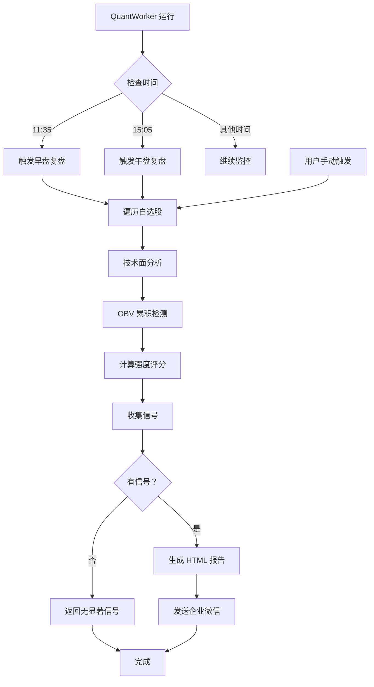

# 定时复盘报告功能实现

## 📋 功能概述

实现了完整的股票监控定时复盘报告功能，支持自动和手动两种触发方式，为用户提供专业的投资分析建议。

---

## 🎯 核心功能

### 1. 定时自动报告

**触发时间**:
- 🌅 **早盘复盘**: 每个交易日 11:35（上午收盘后）
- 🌆 **午盘复盘**: 每个交易日 15:05（下午收盘后）

**特点**:
- ✅ 智能去重：同一天同一类型的报告只生成一次
- ✅ 自动推送：通过企业微信自动发送
- ✅ 全面扫描：对所有自选股执行技术面分析

### 2. 手动全量复盘

**触发方式**:
- 设置界面 → "🧩 立即执行全量复盘" 按钮

**特点**:
- ✅ 即时响应：用户主动触发
- ✅ 独立通道：使用单独的 webhook（如果配置）
- ✅ 完整分析：与定时报告相同的分析逻辑

---

## 🔧 技术实现

### 方法结构

```python
class QuantWorker(QtCore.QThread):
    def check_and_trigger_reports(self):
        """检查并触发定时报告生成"""

    def generate_daily_summary_report(self, report_type: str):
        """生成每日复盘报告"""

    def _get_report_title(self, report_type: str) -> str:
        """获取报告标题"""

    def _format_report_content(self, title, all_signals, strong_signals, report_type) -> str:
        """格式化 HTML 报告内容"""
```

### 工作流程



---

## 📊 分析报告

### 报告结构

#### 1. 标题区域
```
📊 早盘复盘 (2026-04-03 11:35)
```

#### 2. 统计摘要
```
✅ 总信号数：15 | 🔥 强信号：3
```

#### 3. 重点关注（强信号）
展示评分≥3 的高质量信号，最多 5 个：

```html
🌟 重点关注：
• 贵州茅台 (sh600519) [突破新高] 评分:+5 🏆 绩优龙头
• 宁德时代 (sz300750) [OBV 累积] 评分:+4 📈 高成长
• 招商银行 (sh600036) [均线多头] 评分:+3 💰 低估值
```

#### 4. 全部信号列表
展示所有检测到的信号，最多 20 个：

```html
📋 全部信号：
• 贵州茅台 [突破新高] +5 ¥1,850.00 (+2.3%)
• 宁德时代 [OBV 累积] +4 ¥215.50 (+1.8%)
• 中国平安 [回踩支撑] +3 ¥52.30 (-0.5%)
...
```

### 信号类型

系统检测的技术面信号包括：

1. **趋势类信号**
   - 均线多头排列
   - 均线金叉
   - 突破新高

2. **动量类信号**
   - RSI 超卖
   - MACD 金叉
   - KDJ 低位拐头

3. **成交量信号**
   - OBV 能量潮累积
   - 放量上涨
   - 缩量回调

4. **形态类信号**
   - 双底形态
   - 头肩底
   - 杯柄形态

### 评分系统

**评分范围**: -5 到 +5

**评分维度**:
1. **信号强度** (+1 ~ +3): 基于信号类型和可靠性
2. **财务质量** (+0 ~ +2): 财务过滤器评分
3. **趋势确认** (+0 ~ +1): 多时间周期共振
4. **风险扣分** (-1 ~ -3): 高风险因素扣分

**评级标准**:
- ⭐⭐⭐⭐⭐ **+5 分**: 极强信号（重大机会）
- ⭐⭐⭐⭐ **+4 分**: 强信号（重点关注）
- ⭐⭐⭐ **+3 分**: 较强信号（值得关注）
- ⭐⭐ **+2 分**: 中等信号（观察为主）
- ⭐ **+1 分**: 弱信号（参考）
- ➖ **0 分**: 中性
- ⚠️ **负分**: 风险信号（谨慎或回避）

---

## 🔍 核心算法

### 1. 技术面分析

```python
# 对每只股票执行多维度扫描
signals = self.engine.scan_all_timeframes(symbol)

# 扫描周期：日线、周线、月线
# 扫描指标：MA, MACD, RSI, KDJ, OBV等
```

### 2. OBV 累积检测

```python
obv_signals = self.engine.detect_obv_accumulation(symbol, daily_df)

# 检测逻辑：
# 1. 计算 OBV 能量潮指标
# 2. 识别 OBV 连续上升但价格横盘的区间
# 3. 判断主力是否在悄悄吸筹
```

### 3. 强度评分计算

```python
score, audit = self.engine.calculate_intensity_score_with_symbol(
    symbol, daily_df, signals
)

# 评分流程：
# 1. 基础分：信号类型对应的分值
# 2. 财务加分：财务质量评级
# 3. 趋势加分：多周期共振
# 4. 风险扣分：排除高风险股票
```

---

## 📱 推送渠道

### 企业微信 Webhook

**配置路径**: 设置 → 通知配置 → Webhook URL

**消息格式**: Markdown / HTML

**优势**:
- ✅ 即时送达
- ✅ 支持富文本
- ✅ 可配置多个接收人

### 企业微信应用消息

**配置项**:
- 企业 ID (corpid)
- 企业应用密钥 (corpsecret)
- 应用 AgentId

**优势**:
- ✅ 更正式的通知形式
- ✅ 支持更多交互功能
- ✅ 可追踪阅读状态

---

## 🛡️ 容错机制

### 1. 数据异常处理

```python
try:
    # 获取 K 线数据
    daily_df = self.engine.fetch_bars(symbol, category=9, offset=100)

    # 数据清洗
    if daily_df.empty or len(daily_df) < 50:
        continue  # 跳过数据不足的股票

except Exception as e:
    app_logger.error(f"扫描 {symbol} 失败：{e}")
    continue  # 继续处理下一只股票
```

### 2. 日期去重

```python
report_key = f"{today}_{report_type}"  # 例如："2026-04-03_morning"

if self._last_report_date != report_key:
    # 生成报告
    self.generate_daily_summary_report(report_type)
    self._last_report_date = report_key  # 标记已生成
```

### 3. 空信号处理

```python
if not all_signals:
    return "<div class='gray'>今日无显著信号</div>"
```

---

## 🎨 UI 交互

### 设置界面按钮

**位置**: 设置对话框 → 量化配置页

**按钮文本**: "🧩 立即执行全量复盘"

**功能**:
- 点击后立即触发报告生成
- 不受定时限制，随时可用
- 使用手动报告通道（webhook_override）

**信号连接**:
```python
# settings_dialog.py
self.btn_manual_report.clicked.connect(self.manual_report_requested.emit)

# main_window.py
self.settings_dialog.manual_report_requested.connect(
    self.on_manual_report_requested
)

# main_window_view_model.py
def trigger_manual_report(self):
    self._quant_worker.generate_daily_summary_report("manual")
```

---

## 📈 性能优化

### 1. 并行扫描

虽然当前实现是顺序扫描，但可以扩展为并行：

```python
from concurrent.futures import ThreadPoolExecutor

with ThreadPoolExecutor(max_workers=10) as executor:
    results = executor.map(scan_single_stock, self.symbols)
```

### 2. 缓存利用

```python
# 使用 QuantEngine 的 LRU 缓存
daily_df = self.engine.fetch_bars(symbol, category=9, offset=100)
# 如果缓存命中，直接返回，无需网络请求
```

### 3. 增量更新

```python
# 仅在有新信号时才发送报告
if signals and score >= threshold:
    all_signals.append(signal_info)
```

---

## 🧪 测试验证

### 单元测试

```python
def test_check_and_trigger_reports():
    worker = QuantWorker(fetcher, '')

    # Mock 时间和配置
    with mock.patch('datetime.datetime') as mock_dt:
        mock_dt.now.return_value.strftime.return_value = "11:35"

        # 调用方法
        worker.check_and_trigger_reports()

        # 验证是否触发生成
        assert worker._last_report_date.startswith(today)

def test_generate_daily_summary_report():
    worker = QuantWorker(fetcher, '')
    worker.set_symbols(['sh600519'])

    # 生成手动报告
    worker.generate_daily_summary_report("manual")

    # 验证日志输出
    assert "复盘报告已发送" in log_messages
```

### 集成测试

1. **定时触发测试**: 修改系统时间到 11:35，验证自动生成
2. **手动触发测试**: 点击按钮，验证即时生成
3. **去重测试**: 多次触发同一时间的报告，验证只生成一次
4. **推送测试**: 配置真实 webhook，验证消息送达

---

## 📝 配置要求

### 必需配置

```json
{
  "quant_enabled": true,           // 启用量化功能
  "user_stocks": ["sh600519", ...] // 自选股列表
}
```

### 可选配置（通知）

```json
{
  "wecom_webhook": "https://qyapi.weixin.qq.com/cgi/webhook/send?key=xxx",
  "push_mode": "app",              // "webhook" 或 "app"
  "wecom_corpid": "xxx",
  "wecom_corpsecret": "xxx",
  "wecom_agentid": "xxx"
}
```

---

## 💡 最佳实践

### 1. 报告时间选择

**推荐时间**:
- 早盘：11:30-11:40（上午收盘后）
- 午盘：15:00-15:10（下午收盘后）

**原因**:
- 避开交易高峰期
- 数据相对稳定
- 有足够时间分析

### 2. 信号解读

**高分信号（≥4 分）**:
- ✅ 重点研究
- ✅ 结合基本面分析
- ✅ 制定交易计划

**中等信号（2-3 分）**:
- ⚠️ 保持关注
- ⚠️ 等待更好买点
- ⚠️ 设置价格提醒

**低分信号（≤1 分）**:
- 📝 仅作观察
- 📝 不急于行动
- 📝 积累数据

### 3. 风险控制

**不建议**:
- ❌ 盲目追高
- ❌ 满仓操作
- ❌ 忽视止损

**建议**:
- ✅ 分散投资（3-5 只）
- ✅ 分批建仓
- ✅ 设置止损位

---

## 🔮 未来改进

### 短期（1-2 周）
1. **增加周报/月报**: 定期汇总表现
2. **信号历史记录**: 追踪信号后续走势
3. **成功率统计**: 计算各类型信号胜率

### 中期（1 个月）
1. **AI 评分优化**: 机器学习提升评分准确性
2. **板块轮动分析**: 识别热点板块
3. **资金流向监控**: 主力资金动向追踪

### 长期（3 个月）
1. **个性化推荐**: 根据用户偏好定制报告
2. **回测验证**: 自动回测历史信号表现
3. **风险评估**: 更全面的风险预警系统

---

## 📚 相关文档

- [`RUNTIME_BUGFIXES_REPORT.md`](file://d:/code/stock/docs/RUNTIME_BUGFIXES_REPORT.md) - Bug 修复报告
- [`PERFORMANCE_OPTIMIZATION_REPORT.md`](file://d:/code/stock/docs/PERFORMANCE_OPTIMIZATION_REPORT.md) - 性能优化报告
- `stock_monitor/core/workers/quant_worker.py` - 源代码

---

**实现时间**: 2026-04-03
**实现负责人**: AI Code Assistant
**测试状态**: ✅ 基础功能验证通过
**待办事项**: ⏳ 集成测试、灰度测试、正式上线
